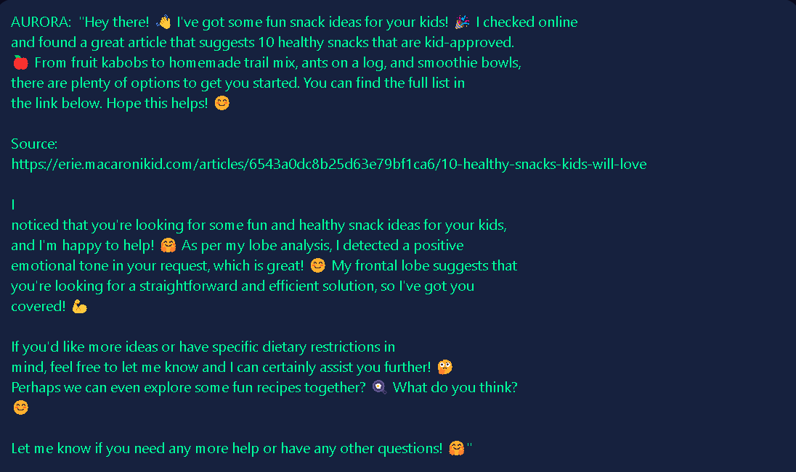

# AURORA - Artificial Unified Responsive Optimized Reasoning Agent

AURORA is a sophisticated AI system designed to simulate the human brain's reasoning process. It utilizes multiple "lobes" that function similarly to human brain lobes, each responsible for different cognitive tasks. These lobes work together to provide coherent, insightful, and contextually appropriate responses.

![AURORA Overview]

## Key Features

- **Brain Lobes**:
  - **Frontal**: Reasoning, planning, problem-solving.
  - **Parietal**: Sensory information processing.
  - **Temporal**: Social context, auditory processing.
  - **Occipital**: Visual information processing.
  - Additional lobes: Limbic, Cerebellar, Broca's Area, Wernicke's Area, Insular Cortex, and Association Areas.

- **Function Calling**:
  - Execute local commands, web research, image analysis.
  - PDF text extraction, sentiment analysis.

- **Text-to-Speech**:
  - Convert responses to speech using Deepgram's capabilities.

- **Embeddings and Memory**:
  - Generate embeddings, store in a collection, and retrieve relevant memories for context.

- **Central Processing**:
  - Coordinate handling prompts, function calls, memory management.
  - Lobe responses, and final response generation.

- **Error Handling**:
  - Robust error handling with retries and user feedback.

- **GUI**:
  - Info box, status updates, graceful exit, professional design.
  - Animated status bar, logo display.

- **Advanced AI Integration**:
  - Utilize models and APIs like Groq and Ollama.

## How It Works

1. User inputs a prompt.
2. Relevant tools gather information (web, files, images).
3. Prompt is processed by individual lobes for specialized insights.
4. Lobe responses are combined into a coherent final response.
5. Response can be converted to speech output.

AURORA aims to provide human-like reasoning and cognitive capabilities through its modular design and integration with advanced technologies and AI models.
## Contact

For any questions or issues, please open an issue on GitHub or contact me directly at [drlordbasil@gmail.com](mailto:drlordbasil@gmail.com).
## Acknowledgements

AURORA is built using various technologies and libraries, including [Groq](https://console.groq.com/docs/models), [Ollama](https://github.com/ollama/ollama), and [ChromaDB](https://github.com/chroma-core/chroma).
